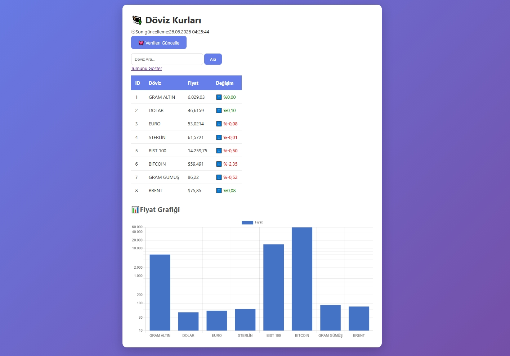

# 💱 Döviz Takip Dashboard

Python ve Flask ile geliştirilmiş, canlı döviz kurlarını takip eden web uygulaması.

## 🚀 Özellikler

- 📊 Canlı döviz, altın, kripto ve borsa verileri
- 🔄 Otomatik (5 dk) ve manuel güncelleme
- 🔍 Döviz arama
- 🆙 Renkli değişim göstergeleri (artış/azalış)
- 📈 Logaritmik grafik görselleştirme
- 🕐 Son güncelleme zamanı
- 📱 Mobil uyumlu modern tasarım

## 🛠️ Kullanılan Teknolojiler

- **Python**
- **Flask** - Web framework
- **BeautifulSoup** - Web scraping
- **SQLite** - Veritabanı
- **Chart.js** - Grafik görselleştirme

## 📦 Kurulum

```bash
pip install flask requests beautifulsoup4
python flask_doviz.py
```

Tarayıcıda `http://127.0.0.1:5000` adresini açın.

## 📸 Ekran Görüntüsü


